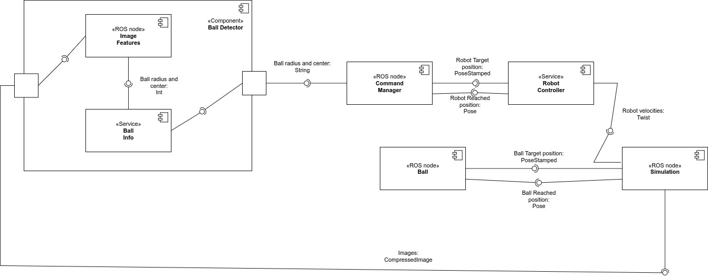
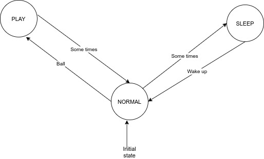

# Behavioral Architecture with Real Simualtion
ROS architecture for a robot moving into a simulated arena. The robot has 3 behaviors:
- Play
- Sleep
- Normal

The user can interact with the robot by moving the ball
# Software architecture and states diagrams
## Software architecture 
The architercture is composed by 5 components: 

- Ball: simulate a user that move the ball into the arena

- Ball detection: detect the green ball

- Robot controller: control the robot toward a target position

- Command manager: implement robot behaviors through a FSM

- Simulation: simulate the robot and the enviroment

<p align="center">
  
</p>

## State diagram
The finite state machine is composed by 3 state (robot behaviors):

- PLAY: the robot follows the ball and when the ball is stationary, it rotates its head 45 degrees to the left and 45 degrees to the right. Back in position, the robot follows the ball

- NORMAL (initial state): robot moves in a random ways

- SLEEP: robot goes to home position, it stays there for a certain time and then goes to NORMAL state

<p align="center">
  
</p>

## ROS messages and parameters
The messages are:

- `PoseStamped`: robot or ball target position
- `Pose`: position reached by the robot or the ball
- `String`: radius and center of the ball
- `Int`: radius and center of the ball
- `CompressedImage`: images received from the camera
- `Twist`: robot velocities

The parameters are:

- `home_pos_x,home_pos_x`: define the home position in the map (double)
- `map_x,map_y`: define the dimensions of the map (integer)
- `min_delay_command,max_delay_command`: define the min and max delay for sending the random position of the ball (double)
- `min_transition_play_normal,max_transition_play_normal`: define the min and max delay to trasit between PLAY and NORMAL (integer)
- `min_transition_normal_sleep,max_transition_normal_sleep`: define the min and max delay to trasit between NORMAL and SLEEP (integer)
- `min_sleep_delay,max_sleep_delay`: define the min and max delay for the SLEEP state (double)
- `min_dis_ball_delay,max_dis_ball_delay`: define the min and max delay for disappearing the ball (int)


# Packages and files
There are 3 packages:

- `Sensoring`: contains the [command.py](sensoring/src/command.py) and [ball_detector.py](sensoring/src/ball_detector.py) files used to move the ball and detect it
- `Robot control`: contains the [robot_controller.py](robot_control/src/robot_controller.py) file used to move the robot toward a target position
- `Command manager`: contains the [command_manager.py](manager/src/command_manager) file that implements the FSM of robot behaviors.
- `Simulation`: contains all the files necessary for running the simulation
# Installation and running
In order to run this software, the following prerequisities are needed:
- [ROS Noetic](http://wiki.ros.org/noetic)
- [smach](http://wiki.ros.org/smach)
- [gazebo](http://gazebosim.org/)
- [gazebo ros control](http://gazebosim.org/tutorials/?tut=ros_control)

Before running the software, you must have all files as executable otherwise you can make them executable with the following command
```
cd <your_workspace>/src/Behavioral-Architecture-with-Real-Simulation
chmod +x sensoring/src/*
chmod +x robot_control/src/*
chmod +x manager/src/*
```
To run the software
```
cd <your_workspace>
catkin_make
source devel/setup.bash
cd src/Behavioral-Architecture-with-Real-Simulation
roslaunch launch_file.launch
```

# Working hypothesis and environment
The robot is a pet that interact with a human who moves the ball into an a simulated arena. Target position of the robot and the ball belong to the arena. The robot has 3 behaviours: PLAY,NORMAL,SLEEP. The PLAY behaviour will start only if the robot sees the ball. The ball is green and is very big with respect to the robot in order to detect it. The home position can be initialize before starting the simulation and cannot be changed during the execution. The word "someTimes" is inteded as number of cycles for which it si executed a piece of code. The ball has no collisions

# System's features
- Specify different dimensions of the arena
- It is possibile to define different delays for the simulation
- Define different position of the "home" inside the arena before start the simulation
- It is possible to visualize the states transition in the shell
- The robot will notify if it will reach the target position and it is possibile to visualize it in the shell (the position that the robot has reached)
- The robot can perceives the ball even if it is moving in the NORMAL state
- It is possibile to see the camera of the robot in a separated window with the possibility to see a circle around the detected ball
- It is possible to make the ball disappear simply by moving it under the ground

# System's limitations


# Possible technical improvements


# Author and contact
[Simone Voto](https://github.com/Cavalletta98) - simone.voto98@gmail.com